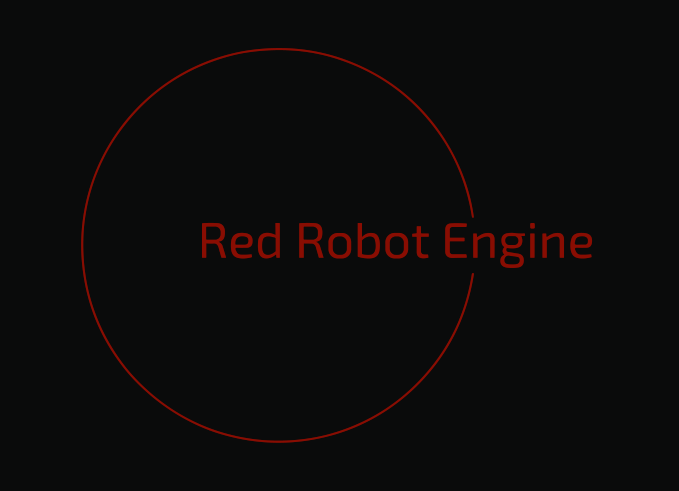

> # RedRobot Engine
> 
> 
> Hey there, code wranglers! 🚀 Welcome to RedRobot Engine, where the code is snappy, the performance is top-notch, and we take our game development as seriously as a cat chasing a laser pointer.

> ## What's the Deal?
> 
> 
> RedRobot Engine is our brainchild, born from the minds of code wizards who looked at other game engines and said, "What if we make something that's lean, mean, and makes coding feel like a walk in the park?"

> ## Key Features:
> 
> 
> 
> 
> * **C++20 Swagger:** RedRobot Engine starts off with the coolness of C++20, making your code look more stylish than a catwalk model.
> 
> * **Godot's Cool Cousin:** Inspired by Godot, RedRobot Engine brings that awesome Godot's node flavor but with a focus on C++. It's like Godot's edgier sibling who rides a motorcycle.
> 
> * **No Bloat, No Bother:** We're not about that bloat life. RedRobot Engine is sleeker than a cat after a nap, and it won't bog you down with unnecessary baggage.
> 
> * **Raylib5 as Backend:** We've built RedRobot Engine using Raylib5 – like building blocks for game development. It's the Lego set you never knew you needed.
> 
> * **2D Physics - PlayRho (not sure yet):** https://github.com/louis-langholtz/PlayRho
> 
> * **3D Physics - Jolt** https://github.com/jrouwe/JoltPhysics
> 
> * **Modular Mania:** RedRobot Engine is so modular it's practically a game engine transformer. Mix and match, plug and play - your game, your rules.

> ## Current Project State: A Code in Progress 🚧
> 
> 
> Hold onto your coding hats, folks! As of now, RedRobot Engine is in its early stages – think of it as the software equivalent of a doodle on a napkin before the masterpiece. I'm knee-deep in recreating the main editor window, and I've got decisions to make—2D, 3D, or a bold leap into the realm of basic 3D? It's a bit like choosing between chocolate or vanilla ice cream, but with more curly braces.
> 
> The grand plan here is to implement nodes. Yes, you heard it right—nodes! Those magical creatures that make game development a symphony of interconnected parts. Why? Because we're building this ship as we sail it, and nodes are our trusty navigators.
> 
> Oh, did I mention scripts? Brace yourselves. Scripts in RedRobot Engine are like C++ Shared Libraries throwing a wild party. Imagine importing a node header, and boom! You're typing away game mechanics and interactions faster than a caffeinated squirrel on a keyboard.
> 
> So, here we are—early days, a sprinkle of chaos, and a whole lot of excitement. Stay tuned for more updates, laughter, and, of course, code wizardry. Because RedRobot Engine is not just a game engine; it's a comedy club for your CPU.
> 
> Cheers to coding adventures,

> ## Getting Started
> 
> 
> 
> 
> 0. \*\* Before Everything you need `includes/` and `libs/` folder which can be got here (for your pleasure I did a python script that do everything for you): [RedRobot Engine Dependencies](https://github.com/nonunknown777/zengine-deps)
> 1. **Clone the Repo:**
> 
> 
> 
> 
> * `git clone https://github.com/nonunknown777/RedRobot Engine.git`
> 
> 
> 
> 
> 2. **Build the Magic:**
> 
> 
> 
> 
> * `scons -jN` \- where N is processor core count
> make sure you build 2d and 3d physics library and put em in the library folder (not working with them yet, so as an alternative just remove them in the Sconstruct file)
> 
> 
> 
> 
> 
> 3. **Laugh Maniacally:** As your game starts running, unleash an evil genius laugh. You've just embarked on a RedRobot Engine adventure!

> ## Contributing
> 
> 
> Feel like joining the RedRobot Engine revolution? Fork, code, create a pull request. We're all about that collaboration life!

> ## Disclaimer
> 
> 
> This is a game engine, not a comedy club. Laughter is not guaranteed but highly recommended. Side effects may include euphoria, increased coding speed, and an insatiable desire to make the coolest games ever.
> I'm not a professional programmer (and dont have the intentions to be), I'm just a hobbyst guy, this project has no intention to be something professional, please dont create high spectations with this!
> 
> Now, go forth, code like the wind, and let the RedRobot Engine games begin! 🚀🎮
> Cheers, NonUnknown
> 
> 
> ## Beware
> 
> 
> Make sure to read the [License](./LICENSE.MD) before diving into the project!